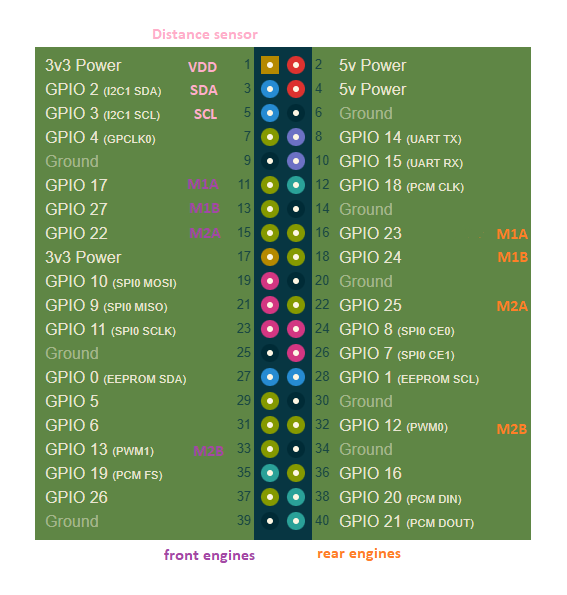
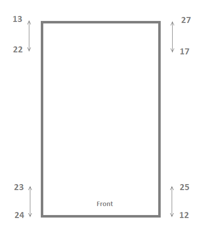
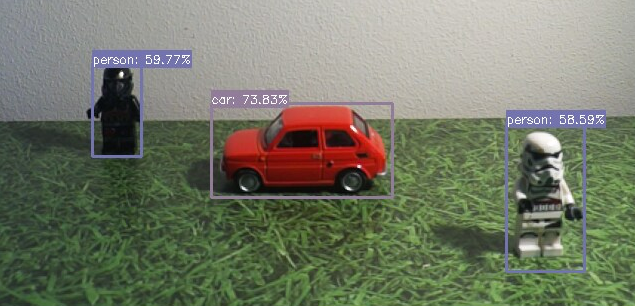

# 4x4 vehicle powered by raspberry pi 5 with camera and range sensor


### Assembled vehicle


---

### Drone elements

Robot-Chassis-NP - four-wheeled robot chassis


Raspberry Pi 5 8GB RAM, 2,4GHz, WiFi DualBand, Bluetooth, PCIe 2.0, 2x CSI/DSI, 2x USB 3.0, 2x 4Kp60 microHDMI


UPS HAT (EU) - uninterruptible power supply module UPS for Raspberry Pi


Raspberry Pi Camera Module 3 Wide


Raspberry Pi Active Cooler - active cooling kit


Cytron Maker Drive MX1508 - dual channel dc motor controller


Basket for 4 AA R6 batteries with cover and switch


Distance sensor module TOF10120


---

### Wiring and pin layout

wiring



pin layout



---

### Create python environment
```bash
# create env
python3 -m venv --system-site-packages env

# activate it
source env/bin/activate

# install packages
pip install -r requirements.txt 
```

### Manual driving 
```bash
source env/bin/activate
python -m app.manual
```

### Object detection - original model
```bash
# on development env
python -m app.detection

# on car env
python -m app.detection --runtimeOnly
```

